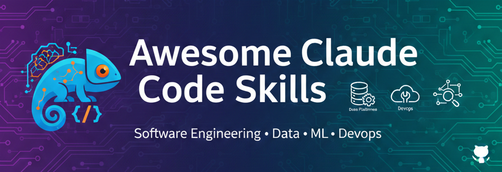

# Awesome Claude Code Skills

A curated list of code-focused Claude Skills for software engineering, data platforms, ML, and DevOps. Each skill lives in its own folder with a SKILL.md file.

## Contents
- Data Platforms and MLOps
- DevOps and Platform Engineering
- Computer Vision

## Skills

### Data Platforms and MLOps
- [Databricks MLflow Architect](./databricks-mlflow-architect/) - Design Unity Catalog medallion pipelines with Spark ETL, model zoo evaluation, and MLflow tracking.

### DevOps and Platform Engineering
- [Kubernetes Pipeline Designer](./kubernetes-pipeline-designer/) - Design CI/CD pipelines for Kubernetes with build, scan, deploy, and rollback strategies.

### Computer Vision
- [Computer Vision Object Detection](./computer-vision-object-detection/) - Plan data, training, evaluation, and deployment for object detection models.

## Contributing
See CONTRIBUTING.md.
